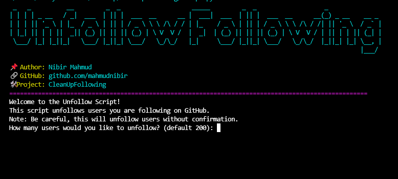

# GitHub Unfollow Script

 


 

---
> [!NOTE]
 This project is intended for learning and experimentation. Please use it responsibly and ethically.

--- 

## 📚 Table of Contents  
- [Overview](#overview)  
- [Features](#features)  
- [Prerequisites](#prerequisites)  
- [Configuration](#configuration)  
- [Running the Script](#running-the-script) 
- [License](#license)  
- [Contact](#contact)  
- [Support](#support)

## Overview




This Python script automates the process of unfollowing users on GitHub. It uses the GitHub API to interact with your account, fetch the last 200 users (or a specified limit)  you are following, and unfollow them one by one. The script is designed to help you quickly manage your following list on GitHub.

## Features
- Automatically unfollows the last 200 users (or a specified limit) you're following on GitHub.
- Uses GitHub API for interaction with your account.
- Implements rate limiting with a 1-second delay between each unfollow request to avoid hitting GitHub's API rate limits.
- Easily customizable to change the number of users to unfollow or add extra features.
-Logs unfollowed Users

## Prerequisites
- Python 3.x
- `requests` library

### Install Python Dependencies
You can install the required `requests` library using pip:
```bash
pip install requests
```

## Configuration
Before running the script, you'll need to configure it with your GitHub account information.

### Generate a GitHub Personal Access Token:
Go to GitHub Personal Access Token Documentation to generate a token.

### Update the script:
Replace `GITHUB_ACCESS_TOKEN` with your generated GitHub token.

Replace `GITHUB_USERNAME` with your GitHub username in the script.

## Running the Script
Clone the repository:
```bash
git clone https://github.com/mahmudnibir/CleanUpFollowing.git
cd CleanUpFollowing
```


Run the script:
```bash
python script.py
```
This will start unfollowing the last 200 users you are following on GitHub.

## License  

📝 This project is licensed under the **MIT License**. See the [LICENSE](LICENSE) file for details.  

---

## Contact  
*Developed by [Nibir Mahmud](https://github.com/mahmudnibir)*


📧 **Email**: [nibirbbkr@gmail.com](mailto:nibirbbkr@gmail.com)  
🐦 **Github**: [@mahmudnibir](https://github.com/mahmudnibir)    

---


## Support  

> [!NOTE]
If you find this project helpful, **please consider giving it a star ⭐ on GitHub!** It helps others discover the project.  

---